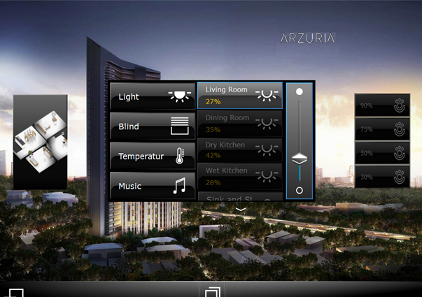
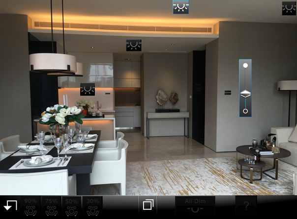

# KNX-Based Lighting Control System (Mock-Up Apartment)

This repository documents a KNX project I implemented back in 2014 for a mock-up apartment unit. The system was designed to demonstrate **lighting control functionality** using **KNX switching and dimming actuators**, with a user-friendly GUI displayed on an iPad.

While the original ETS files and group address list are no longer available, this repo includes:
- GUI screenshots of the working system
- A reconstructed overview of group address functions
- Topology notes based on deployment memory

---

## 🔧 System Overview

- **Project type:** Lighting automation for demo apartment
- **Year:** 2014
- **Technology:** KNX TP1 (twisted pair bus)
- **ETS version:** ETS 4
- **Devices used:**
  - Switching actuator (JUNG 2304.16REGHM)
  - Dimming actuator (JUNG 3904REGHE)
  - Push-button input modules (JUNG 4194TSM) for traditional control (wall mounted)
---

## 🖥️ User Interface Screenshots

Main control panel GUI with zone-based switching and dimming functions.

Room control interface with dimming levels.

This GUI allowed residents to:
- Toggle lighting in multiple rooms
- Dim individual zones (Living, Dining, Kitchen)
- Use a visual slider for brightness level
- Trigger "All Dim" presets (90%, 75%, etc.)

---

## Functional Design (Reconstructed)

| Zone               | Function         | Notes                          |
|--------------------|------------------|--------------------------------|
| Living Room        | Switch + Dim     | Single dimming channel + scene |
| Dining Room        | Switch only      | Soft ambient dimming           |
| Dry Kitchen        | Switch + Dim     | Toggle lighting ON/OFF         |
| Wet Kitchen        | Switch           | Simple ON/OFF with timer logic |

---

## My Role

- Designed and programmed the group address structure
- Assigned actuator channels to functions
- Tested dimming levels, scene recall, and status feedback
- Coordinated with apartment's marketing and engineering teams

---

## Project Limitations

- No blinds or HVAC integration in this demo unit
- The group addresses are **representative only** and do not reflect the original confidential ETS configuration.
---

## Lessons Learned

- Practical experience with ETS software and group object planning
- Troubleshooting physical KNX bus during device commissioning
- Stakeholder communication for live demo readiness
